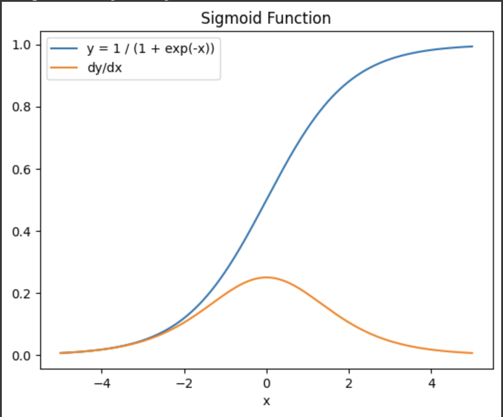
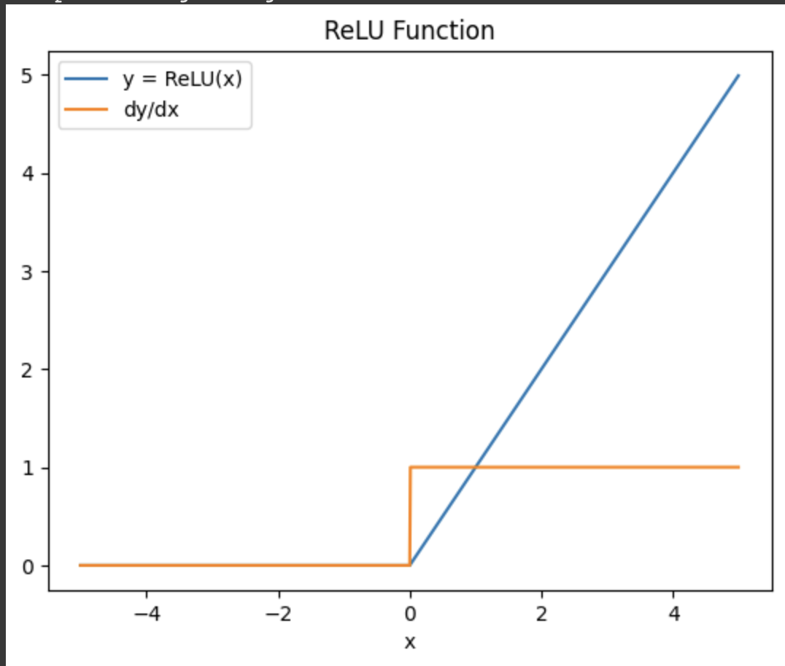
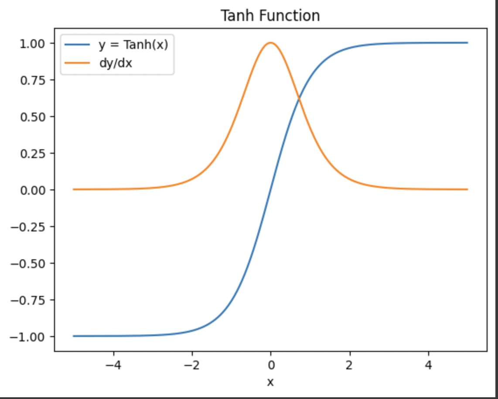

# Activations

## Sigmoid

This simple sigmoid activation function is often used to clamp values in between `[0, 1]` which is shown below.

### Forward

The forward pass takes a simple form.
$$
y(x) = \frac{1}{1 + \exp(-x)}
$$

### Backward

Because the function is elementwise, the backward $\partial Y / \partial X$ only takes on the single values at each element.

Using the quotient rule:
$$
\frac{y_i}{x_i} = \frac{
    \partial (1)(1 + \exp(-x)) - 1\partial(1 + \exp(-x))
}{
    (1 + \exp(-x))^2
}
$$
$$
\frac{y_i}{x_i} = \frac{
    \exp(-x)
}{
    (1 + \exp(x))^2
}
$$
$$
\frac{y_i}{x_i} = \frac{\exp(-x) - 1 + 1}{1 + \exp(x)}
\frac{1}{1 + \exp(x)}
$$
$$
\frac{y_i}{x_i} = \frac{\exp(-x) - 1 + 1}{1 + \exp(-x)}
sigmoid(x)
$$
$$
\frac{y_i}{x_i} = \begin{bmatrix}\frac{1 + \exp(-x)}{1 + \exp(-x)} - \frac{1}{1 + \exp(-x)}\end{bmatrix}
sigmoid(x)
$$
$$
\frac{y_i}{x_i} = \begin{bmatrix}1 - sigmoid(x)\end{bmatrix}
sigmoid(x)
$$

## Rectified Linear Unit (ReLU)

### Forward

A rectified linear unit is a simple piecewise function:
$$
y(x) = \begin{cases}
x && \text{if } \space x > 0 \\
0
\end{cases}
$$

### Backward

And the derivative is very simple, effectively working as a pass through function for upstream gradients. Unfortunately the gradient is discontinuous at the point where $x == 0$.
$$
\frac{\partial f(x)}{\partial x} = \begin{cases}
1 && \text{if } \space x > 0 \\
0
\end{cases}
$$

# Tanh

The tanh function like the sigmoid function is a smooth squashing function but instead of `[0, 1]` goes to `[-1, 1]`.

### Forward
$$
y(x) = \tanh(x) = \frac{
    e^{x} - e^{-x}
}{
    e^{x} + e^{-x}
}
$$

### Backward
$$
\frac{\partial \tanh(x)}{\partial x} = \frac{
\partial (e^x - e^{-x})(e^x + e^{-x}) -
(e^x - e^{-x})\partial (e^x + e^{-x})
}{
    (e^x + e^{-x})^2
}
$$
$$
\frac{\partial \tanh(x)}{\partial x} = \frac{
 (e^x + e^{-x})^2 - (e^x - e^{-x})^2
}{
    (e^x + e^{-x})^2
}
$$
$$
\frac{\partial \tanh(x)}{\partial x} = \frac{
 (e^x + e^{-x})^2 
}{
    (e^x + e^{-x})^2
} - \frac{
(e^x - e^{-x})^2
}{
    (e^x + e^{-x})^2
}
$$

$$
\frac{\partial \tanh(x)}{\partial x} = 1 - \tanh^2(x)
$$

## Softmax

The softmax function is a differentiable way to get a normalized maximum value. This is typically the output of a classification module. 

### Forward

The forward function values after all sum to one and are between `[0, 1]`.
$$
\text{softmax}(x_i) = \frac{
    \exp(x_i)
}{
    \sum_j \exp(x_j)
}
$$

### Backward

The backward function, unlike the other activations functions is a Jacobian as the derivative $\partial \text{softmax}(x_i) / \partial X$ depends on all of the other values through the sum in the denominator.

So then we want to compute the Jacobian:
$$
\frac{\partial y(x_i)}{\partial X} =  \begin{bmatrix}
\frac{\partial y(x_0)}{\partial x_0} & ... & \frac{\partial y(x_0)}{\partial x_N} \\
& ... & \\
\frac{\partial y(x_0)}{x_N} & ... & \frac{\partial y(x_N)}{x_N}
\end{bmatrix}
$$

So we can compute each component individually as:

$$
\frac{\partial y(x_i)}{\partial x_j} = \frac{
\partial e^{x_i}(\sum_k e^{x_k}) - e^{x_i}\partial\sum_k e^{x_k}
}{
(\sum_k e^{x_k})^2
}
$$

We can imagine two different situations which changes the derivative.

if $i == j$:

$$
\frac{\partial y(x_i)}{\partial x_j} = \frac{
e^{x_i}(\sum_k e^{x_k}) - e^{x_i}e^{x_i}
}{
(\sum_k e^{x_k})^2
}
$$

$$
\frac{\partial y(x_i)}{\partial x_j} = \frac{
    e^{x_i}
}{\sum_k e^{x_k}} \left[
\frac{\sum_k e^{x_k} - e^{x_i}}{\sum_k e^{x_k}}
\right]
$$

$$
\frac{\partial y(x_i)}{\partial x_j} = \frac{
    e^{x_i}
}{\sum_k e^{x_k}} \left[
\frac{\sum_k e^{x_k}}{\sum_k e^{x_k}} -
\frac{e^{x_i}}{\sum_k e^{x_k}}
\right]
$$

Which we can see is just:
$$
\frac{\partial y(x_i)}{\partial x_j} =
\text{softmax}(x_i)\left[1 - \text{softmax}(x_i)\right]
$$

if $i \ne j$

$$
\frac{\partial y(x_i)}{\partial x_j} = \frac{
- e^{x_i}e^{x_j}
}{
(\sum_k e^{x_k})^2
}
$$

$$
\frac{\partial y(x_i)}{\partial x_j} = \frac{
- e^{x_i}
}{
\sum_k e^{x_k}
}  \frac{
e^{x_j}
}{
\sum_k e^{x_k}
}
$$

Which then is:
$$
\frac{\partial y(x_i)}{\partial x_j} = -
\text{softmax}(x_i)\text{softmax}(x_j)
$$