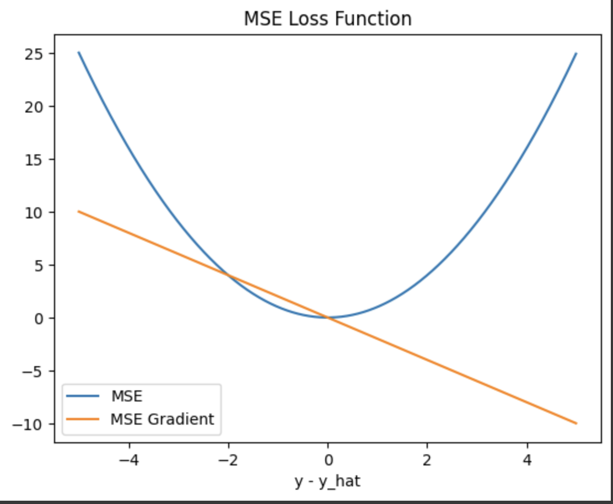
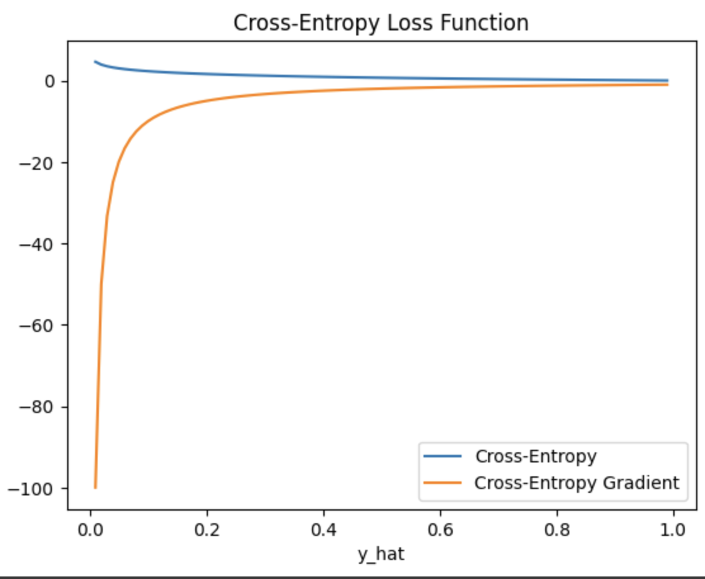

# Losses

## Mean Squared Error Loss

Mean squared error is a very common loss for regression problems which is just the average squared error of all dimensions of the output.

$$
\text{MSE}(\hat{y}, y) = \frac{1}{D}\sum_{d=1}^D(y_d - \hat y_d)^2
$$

### Gradient

The output of mean squared error is a scalar in our implementation which means that the gradient w.r.t. the output of the model $Y$ is a matrix of the same shape as $Y$.

$$
\frac{\partial MSE(\hat y, y)}{\partial \hat y} = \begin{bmatrix}
\frac{\partial MSE(\hat y, y)}{y_0} & ... & \frac{\partial MSE(\hat y, y)}{y_N} 
\end{bmatrix}
$$

$$
\frac{\text{MSE}\left(\hat y, y\right)}{\partial \hat y_d} = 
\frac{1}{\partial \hat y_d}  \frac{1}{D}\sum_{d'=1}^D(y_{d'} - \hat y_{d'})^2
$$

$$
\frac{\text{MSE}\left(\hat y, y\right)}{\partial \hat y_d} = 
  \frac{1}{D}\sum_{d'=1}^D \frac{1}{\partial \hat y_d}(y_{d'} - \hat y_{d'})^2
$$

The only portion of this that is not zero is if `d' == d` and so:

$$
\frac{\text{MSE}\left(\hat y, y\right)}{\partial \hat y_d} = 
  \frac{1}{D}\frac{1}{\partial \hat y_d}(y_{d} - \hat y_{d})^2
$$

$$
\frac{\text{MSE}\left(\hat y, y\right)}{\partial \hat y_d} = 
  \frac{2}{D}(\hat y_{d} - y_d)
$$

## Cross-Entropy Loss

Cross entopy loss is a common loss for classification tasks that finds the cross entropy between two different categorical distributions. 

Cross-entropy is related to negative log likelihood of the data. In that framework, we produce a distribution (here categorical). Then we want to determine the likelihood of the dataset under this distribution. For that, we can use the cross-entropy:

$$
H(y, \hat y) = -\sum_i y_i \log(\hat y_i)
$$

### Gradient
Again we are finding derivative of a scalar ($\partial H / \partial Y$) which is the same shape as $Y$. 

$$
\frac{\partial H(y, \hat y)}{\partial \hat y_i} = -\sum_{i'} y_{i'} \frac{\partial \log(\hat y_{i'})}{\partial \hat y_i}
$$

If $i \ne i'$, the derivative is zero and then we only have terms if $i == i'$.
$$
\frac{\partial H(y, \hat y)}{\partial \hat y_i} =  - y_{i} \frac{\partial \log(\hat y_{i})}{\partial \hat y_i}
$$

$$
\frac{\partial H(y, \hat y)}{\partial \hat y_i} =  - \frac{
    y_i}{\hat y_i}
$$

If we assume the softmax function as the output:
$$
\hat y = \text{softmax}(z)
$$

Then we may want to calculate the gradient w.r.t. to the logits $Z$.
$$
\frac{\partial H}{\partial z_i} = \sum_{j=1}^{D}\frac{
    \partial H}{\partial \hat y_j}\frac{\partial\hat y_j}{\partial z_i}
$$

Because the last term is the softmax derivative, we know the form it takes, which is different from $i == j$ and $i \ne j$. Because when $i \ne j$, we know that $y_i == 0$ then we have.

$$
\frac{\partial H}{\partial z_i} = -\frac{y_i
    }{\hat y_i}\left[\hat y_i \left(1 - \hat y_i\right)\right]
$$

$$
\frac{\partial H}{\partial z_i} = -y_i\left(1 - \hat y_i\right)
$$

$$
\frac{\partial H}{\partial z_i} = \hat y_i - y_i
$$
